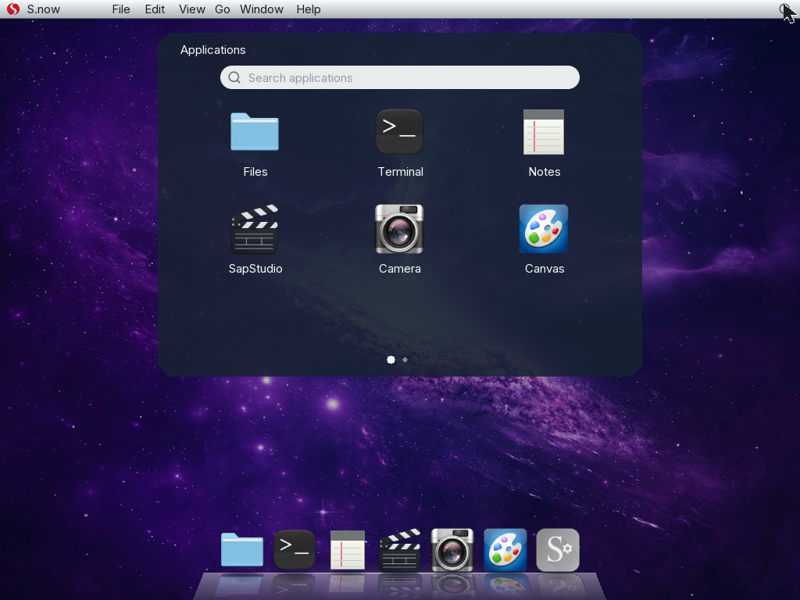

<p align="center">
  
</p>

<h1 align="center">Sapote Redwood</h1>

<p align="center"><strong>A small x86_64 operating system built from first principles.</strong></p>

<p align="center">
  <a href="https://github.com/saudaljuaid/Sapote/actions/workflows/verify.yml"></a>
  
  <a href="LICENSE"></a>
</p>

<p align="center">
  
</p>

<p align="center"><a href="assets/sapote-ui-redesign-25s.mp4"><strong>Watch the 25-second QEMU demo</strong></a></p>

## About

Sapote is a freestanding operating system, not a Linux distribution. It boots
through Multiboot2, enters 64-bit mode, discovers hardware, manages memory and
interrupts, mounts its own filesystems, and draws its own desktop.

Redwood is the current graphical environment. It has movable overlapping
windows, a native 3D Dock, fourteen photographic desktops, Inter typography,
and six applications: Files, Terminal, Notes, SapStudio, Camera, and Settings.

## Highlights

- Four-level paging, W^X mappings, guarded stacks, a checked heap, APIC
  interrupts, monotonic time, and kernel preemption.
- ACPI and PCI discovery with MSI-X, xHCI, NVMe, HD Audio, virtio-net, and a
  typed driver layer for additional PCI hardware.
- Separate read-only system and writable data volumes using FAT32.
- Up to four isolated user processes with private address spaces and saved CPU
  state.
- A versioned native ABI with generation-protected typed handles, a general
  static ELF64 loader, guarded memory, threads/TLS/FPU state, files, events,
  Redwood surfaces, and IPv4 networking.
- A reproducible offline C SDK, a Rust `no_std` application crate, deterministic
  packages, and native Lua 5.4.7 and SQLite 3.46.0 ports.
- Measured Linux syscall profiles for BusyBox `echo`, `uname`, and `cat`.
- IPv4 networking with Ethernet, ARP, ICMP, UDP, DHCP, DNS, TCP, HTTP/1.1, and
  downloads written directly to FAT32.
- A fixed-point 3D Dock with magnification, reflections, tooltips, launch
  bounce, and light or dark shelves.
- Spring window opening, focus, stacking, title-bar dragging, and partial
  framebuffer repainting.
- Functional Files, Notes, Settings, Terminal, Camera plumbing, and a native
  SapStudio workspace.
- 108 QEMU scenarios covering boot, devices, storage, userspace, networking,
  and the Redwood interface.

Camera reports real device availability and never substitutes a wallpaper or
generated image for a live feed. The standard QEMU demo leaves it closed
because that machine has no webcam source.

## Build and boot

Ubuntu 24.04 or a compatible Debian environment is the reference host.

```sh
sudo apt-get install binutils gcc grub-common grub-pc-bin make mtools \
    qemu-system-x86 xorriso
rustup target add x86_64-unknown-none

make verify
make qemu-tests
make run
```

Build products are placed in `build/`, including `sapote.elf`, `sapote.iso`,
and the system and data images.

## Design

C and x86_64 assembly handle machine-facing work. Freestanding Rust validates
complex or untrusted byte formats before the C kernel consumes them and also
supports `no_std` native applications through a separate public crate. The
Boot Ledger orders startup dependencies and records which services were
installed.

The build rejects warnings, unresolved symbols, unexpected linker sections,
W+X mappings, floating-point or SIMD instructions in the kernel, and unsafe
shortcuts around required boot stages.

## Current limits

Sapote remains single-core and targets a controlled QEMU hardware profile.
Redwood's built-in applications remain kernel-owned; native ABI applications
use application-owned content surfaces inside kernel-composed windows.
FAT32 currently uses a 64 MiB geometry, ASCII 8.3 names, 16 MiB files, and no
journal. Networking is IPv4-only and has no TLS, firewall, routing, Wi-Fi, or
physical-NIC support. User processes do not yet have `fork`, `exec`, signals,
IPC, or general POSIX compatibility. HD Audio can communicate with a codec but
does not yet play or capture streams. The NVIDIA layer validates and reads
device contracts; it does not perform mode setting or command submission.

## Documentation

- [Architecture](docs/ARCHITECTURE.md)
- [Native ABI v1](docs/NATIVE_ABI.md)
- [Application packages](docs/APPLICATION_PACKAGES.md)
- [Application loader](docs/APPLICATION_LOADER.md)
- [Native handles](docs/NATIVE_HANDLES.md)
- [Native graphics and input](docs/NATIVE_GRAPHICS.md)
- [Native threads, TLS, and FPU state](docs/NATIVE_THREADS.md)
- [C SDK and porting guide](docs/NATIVE_SDK.md)
- [C runtime coverage](docs/LIBC_COVERAGE.md)
- [Upstream source record](docs/UPSTREAM_PORTS.md)
- [Lua port](docs/LUA_PORT.md)
- [SQLite port](docs/SQLITE_PORT.md)
- [Native limitations](docs/NATIVE_LIMITATIONS.md)
- [Sapote Redwood](docs/REDWOOD.md)
- [Persistent FAT32](docs/FAT32.md)
- [Networking](docs/NETWORKING.md)
- [Processes](docs/MULTIPROCESS.md)
- [Drivers](docs/DRIVERS.md)
- [HD Audio](docs/AUDIO.md)
- [NVIDIA](docs/NVIDIA.md)
- [Linux syscall boundary](docs/LINUX_SYSCALL_ABI.md)
- [Rust boundary](docs/RUST.md)
- [Verification](docs/VERIFICATION.md)
- [Third-party assets](docs/THIRD_PARTY_ASSETS.md)

See [CONTRIBUTING.md](CONTRIBUTING.md) before sending changes. Sapote is
licensed under [GPL-3.0-only](LICENSE).
