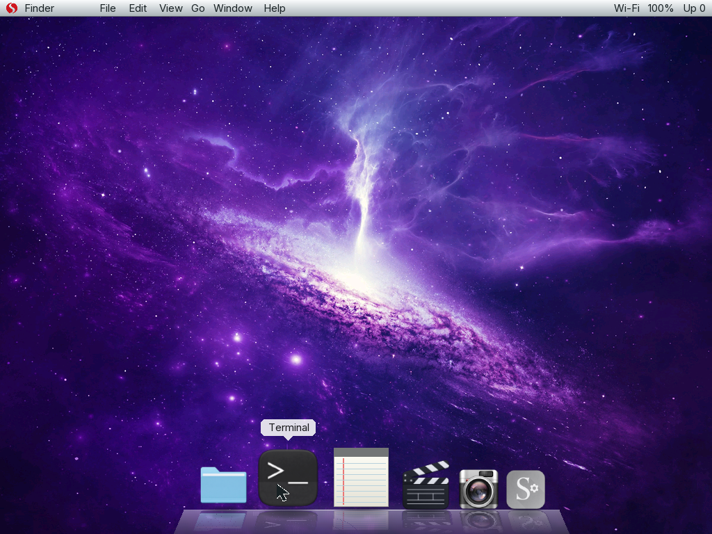
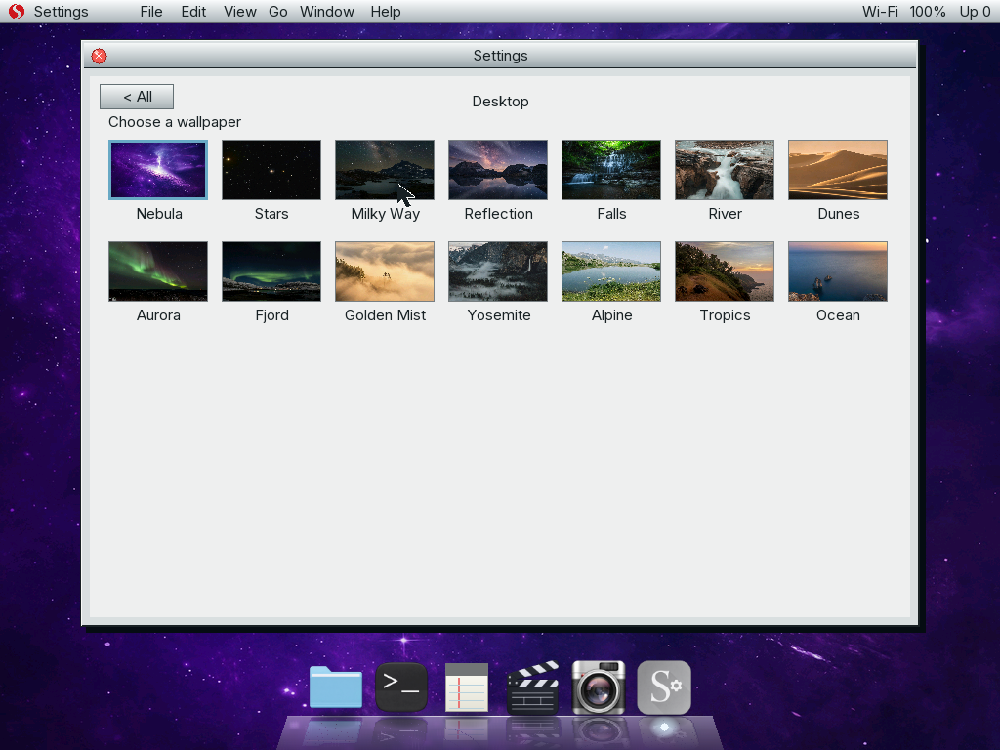

<p align="center">
  
</p>

<h1 align="center">Sapote Redwood</h1>

<p align="center">
  <strong>A small x86_64 operating system built from first principles.</strong><br>
  Sapote brings up its own hardware, proves each boot layer, and runs a measured slice of Linux userspace.
</p>

<p align="center">
  <a href="https://github.com/saudaljuaid/Sapote/actions/workflows/verify.yml"></a>
  
  <a href="LICENSE"></a>
</p>

<p align="center">
  
</p>

<p align="center"><sub>Sapote Redwood, captured from a real 1024×768 QEMU boot.</sub></p>

<p align="center"><a href="assets/sapote-ui-redesign-25s.mp4"><strong>Watch the fast, fluid 25-second QEMU interaction</strong></a></p>

<p align="center"><sub>The public demo leaves Camera closed because the QEMU fixture has no webcam source; Sapote never fabricates a live frame or photo.</sub></p>

<p align="center">
  
</p>

<p align="center"><sub>The native 3D Dock at full hover magnification. Only Sapote's six applications are included.</sub></p>

## Overview

Sapote Redwood is a freestanding operating system—not a Linux distribution and not a
hosted kernel demo. It enters 64-bit mode, discovers hardware, manages memory,
handles interrupts, drives a framebuffer, and presents its own graphical
workspace.

Sapote Redwood is the current compact graphical shell. It combines
the canonical red S mark, fourteen photographic desktops, a compact six-app
reflective 3D Dock, antialiased Inter typography, movable overlapping windows,
classic Files and Notes, a dark green Terminal, the native SapStudio workspace,
icon-rich Settings, and a bounded Camera capture app that reports real device
availability without fake backgrounds or effects.
Separate immutable-system and writable-data FAT32 volumes remain attached
through emulated NVMe. The measured `linux echo`, `linux uname`, and bounded
interactive `linux cat` profiles remain available.

## Fluid desktop

The Dock is a freestanding fixed-point port of the companion `3d-dock` C
implementation. It preserves the original 1.95× raised-cosine magnification,
neighbor displacement, pointer-anchored easing, growing frosted shelf,
perspective reflections, running lights, tooltip fades, press squash, and
decaying launch bounce without bringing Cairo, X11, floating point, or hosted
runtime dependencies into the kernel.

Windows open from their Dock icons with a twelve-frame spring and one bounded
overshoot. Multiple apps remain open, clicking raises them, and title bars drag
with edge clamping. Animation repaints only the old/new changed regions instead
of pushing the complete framebuffer every frame.

<p align="center">
  
</p>

Settings exposes functional Appearance, Desktop, Dock, Displays, Keyboard,
Pointer, Performance, Network, Storage, Camera, Windows, and About pages. Its
Desktop page selects fourteen committed high-quality photographic scenes;
Appearance switches the Dock shelf between Light and Dark without changing its
geometry or behavior.

## Current capabilities

- Four-level paging, W^X mappings, guarded stacks, a checked heap, and bounded DMA.
- ACPI/PCI discovery, APIC interrupts, MSI-X, monotonic time, and preemption.
- Bounded xHCI and multi-controller NVMe I/O, including ordinary NVM writes.
- Deterministic FAT32 formatting, checked mount, nested directories, file
  growth and truncation, random access, rename, deletion, and clean persistence.
- A read-only FAT32 system volume and a separate read-write FAT32 data volume.
- Ring 3 execution with private address spaces and checked ELF64 loading.
- Up to four user processes live at once, each with its own hierarchy, image,
  stack and saved register set, scheduled round robin, isolated from one
  another, and contained when one of them faults.
- Thirty-two bounded drivers overall. Thirteen bind, reset and identify real
  Intel, Realtek,
  AMD, Cirrus Logic and Bochs Display Interface devices through the typed PCI
  substrate.
- An HD Audio driver that talks to codecs over bus-mastering command and
  response rings, with bus mastering withdrawn before the rings are reclaimed.
- Fifteen bounded NVIDIA drivers written from envytools, Nouveau, Mesa/NVK,
  NVIDIA's published material and the PCI and PCI Express specifications, with
  a freestanding Rust VBIOS validator. Eight map a register window, one reads
  only aperture descriptions, six read configuration space and take nothing.
  Four of the fifteen read PCI capabilities every function carries and earn
  their place as cross-checks rather than as vendor knowledge, which the
  documentation says outright. They have never run against NVIDIA silicon; what
  is proved is the decode, the parser, the refusal of every function that is
  not NVIDIA's, and an end-to-end bind against a device model with eleven
  injected defects each refused by name.
- Linux `SYSCALL` support for measured BusyBox `echo`, `uname`, and interactive
  `cat` programs.
- Modern virtio-net PCI/MSI-X/DMA with bounded Ethernet, ARP, IPv4, ICMP,
  UDP, DHCP, DNS, TCP, HTTP/1.1, and streamed FAT32 downloads.
- TCP in both directions, including a bounded passive listener, accepted child
  connections, retransmission/reaping bounds, and RFC 793 resets for closed
  ports.
- An experimental versioned native networking syscall boundary with checked
  user ranges, authenticated process generations, polling, cancellation, time,
  and bounded random bytes.
- Sapote Redwood with six-app 3D Dock, spring windows, multitasking,
  title-bar dragging, Settings, Camera, a framebuffer console, networking and
  filesystem commands, and 101 QEMU scenarios.
- SapStudio's deterministic editor foundation, mirrored at upstream commit
  `034ba9336f6dee3cd5a524a42b740b41013ca852`, with native FAT32 BMP import,
  timeline trim/save, and bounded BMP frame export.

## Build and boot

Ubuntu 24.04 or a compatible Debian environment is the reference host:

```sh
sudo apt-get install binutils gcc grub-common grub-pc-bin make mtools \
    qemu-system-x86 xorriso
rustup target add x86_64-unknown-none

make verify       # clean build and structural checks
make qemu-tests   # run all QEMU scenarios
make run          # boot Sapote Redwood
```

Build products are written to `build/sapote.elf`, `build/sapote.iso`, and the
deterministic system and data images under `build/userspace/`.

## Engineering approach

C and x86_64 assembly own the machine-facing work. A small freestanding Rust
crate validates untrusted bytes—fonts, the logo, persistent FAT32 metadata,
legacy read-only filesystem fixtures, and ELF64 programs—before C uses them.
In short: **C operates the machine; Rust inspects what enters it.**

The Boot Ledger records typed startup capabilities and verifies the installed
state. The build also rejects warnings, unresolved symbols, W+X mappings,
unexpected linker sections, floating-point/SIMD kernel instructions, and
unapproved boot-path shortcuts.

## Project status

Sapote is still a foundation-stage, single-core system. Sapote Redwood is a
fixed six-application shell rather than a general window manager. FAT32 support
is one bounded 64 MiB geometry with an ASCII 8.3 filename subset, 16 MiB files,
no journal, and a clean-sync persistence contract. Networking is intentionally
IPv4-only and supports one modern emulated virtio-net device; it has no IPv6,
TLS, firewall, routing, Wi-Fi, physical-hardware claim, or browser. A TCP
listener makes progress only while an accept is outstanding: there is no
background retransmission timer, no listen queue that survives a caller, and no
concurrent server loop.
Multiprocessing is cooperative and kernel-created: there is no preemptive user
scheduling, no fork, exec, signals, process identifiers or inter-process
communication. The
thirteen bounded drivers bind, reset and identify their devices; none of them
moves data, enables bus mastering, allocates DMA, or takes an interrupt. The
HD Audio driver identifies codecs over DMA rings but plays nothing: there is no
stream descriptor, format negotiation, widget graph, mixer or capture.
The fifteen NVIDIA drivers read fifteen register and configuration contracts
and are not a graphics driver: no mode setting, no framebuffer programming, no
channel, no command submission, no power management despite reading the
capability of that name, and no hardware has ever run them.
General process services, an IOMMU, and broad hardware coverage remain future
work. Sapote Redwood is not a claim of POSIX compliance, a general VFS,
production crash consistency, multi-user security, broad Linux compatibility,
secure Internet access, or a generally stable userspace ABI.

## Documentation

- [Architecture](docs/ARCHITECTURE.md) — the durable map of the kernel
- [Boot Ledger](docs/BOOT_LEDGER.md) — startup dependencies and installed state
- [Sapote Redwood](docs/REDWOOD.md) — current interface and capture contract
- [Third-party visual assets](docs/THIRD_PARTY_ASSETS.md) — pinned Inter,
  Lucide, 3d-dock, and photographic sources and licenses
- [Persistent FAT32](docs/FAT32.md) — volumes, filesystem rules, and persistence
- [Networking](docs/NETWORKING.md) — virtio-net, protocol, syscall, and test bounds
- [Several processes](docs/MULTIPROCESS.md) — private address spaces and bounded scheduling
- [Bounded drivers](docs/DRIVERS.md) — PCI binding, reset, identity, and refusal contracts
- [HD Audio](docs/AUDIO.md) — codec conversation over bounded DMA rings
- [NVIDIA](docs/NVIDIA.md) — register contracts, VBIOS validation, and explicit limits
- [Browser port plan](docs/BROWSER_PORT.md) — concrete future engine work and gaps
- [TLS evaluation](docs/TLS_EVALUATION.md) — prerequisites and explicit non-claims
- [Linux syscall boundary](docs/LINUX_SYSCALL_ABI.md) — measured BusyBox profiles
- [Rust boundary](docs/RUST.md) — where safe byte validation belongs
- [Verification](docs/VERIFICATION.md) — build, QEMU, and evidence gates

Small, reviewable contributions are welcome. See [CONTRIBUTING.md](CONTRIBUTING.md).
Sapote is licensed under [GPL-3.0-only](LICENSE).
