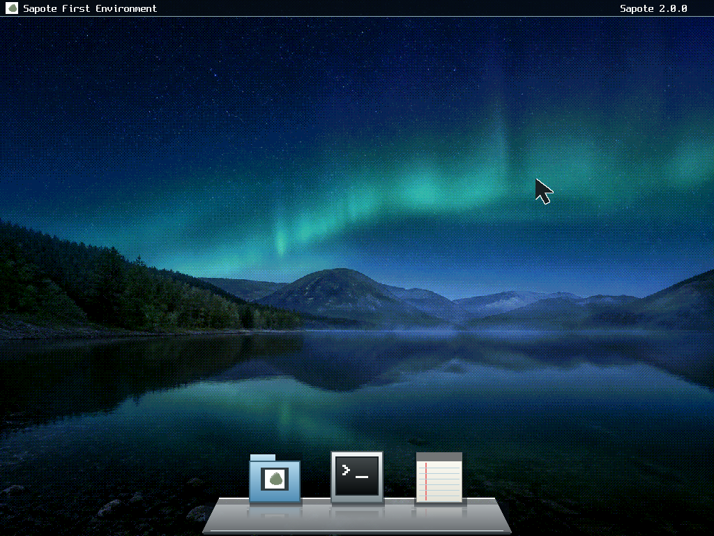
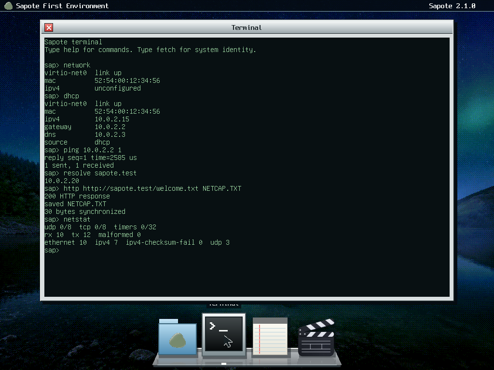

<p align="center">
  
</p>

<h1 align="center">Sapote</h1>

<p align="center">
  <strong>A small x86_64 operating system built from first principles.</strong><br>
  Sapote brings up its own hardware, proves each boot layer, and runs a measured slice of Linux userspace.
</p>

<p align="center">
  <a href="https://github.com/saudaljuaid/Sapote/actions/workflows/verify.yml"></a>
  
  <a href="LICENSE"></a>
</p>

<p align="center">
  
</p>

<p align="center"><sub>Sapote First Environment, captured from a real 1024×768 QEMU boot.</sub></p>

<p align="center"><a href="assets/sapote-first-environment-20s.mp4">Watch the authentic 20-second QEMU interaction</a></p>

<p align="center">
  
</p>

<p align="center"><sub>Sapote 2.1.0 networking over a real QEMU virtio-net packet path.</sub></p>

<p align="center"><a href="evidence/v2.1.0/Sapote-v2.1.0-networking-22s.mp4">Watch the authentic 22-second networking interaction</a> · <a href="evidence/v2.1.0/sapote-v2.1.0-networking.pcap">Inspect the captured Ethernet traffic</a></p>

## Overview

Sapote is a freestanding operating system—not a Linux distribution and not a
hosted kernel demo. It enters 64-bit mode, discovers hardware, manages memory,
handles interrupts, drives a framebuffer, and presents its own graphical
workspace.

Sapote First Environment is the current compact graphical shell. It combines
the canonical green pebble, a photographic desktop, a reflective 3D Dock, a
real FAT32 Files app, a persistent Notes editor, a dark green Terminal, and the
native SapStudio editing workspace.
Separate immutable-system and writable-data FAT32 volumes remain attached
through emulated NVMe. The measured `linux echo`, `linux uname`, and bounded
interactive `linux cat` profiles remain available.

## Current capabilities

- Four-level paging, W^X mappings, guarded stacks, a checked heap, and bounded DMA.
- ACPI/PCI discovery, APIC interrupts, MSI-X, monotonic time, and preemption.
- Bounded xHCI and multi-controller NVMe I/O, including ordinary NVM writes.
- Deterministic FAT32 formatting, checked mount, nested directories, file
  growth and truncation, random access, rename, deletion, and clean persistence.
- A read-only FAT32 system volume and a separate read-write FAT32 data volume.
- Ring 3 execution with private address spaces and checked ELF64 loading.
- Up to four user processes live at once, each with its own hierarchy, image,
  stack and saved register set, scheduled round robin, isolated from one
  another, and contained when one of them faults.
- Thirteen bounded drivers that bind, reset and identify real Intel, Realtek,
  AMD, Cirrus Logic and Bochs Display Interface devices through the typed PCI
  substrate.
- Linux `SYSCALL` support for measured BusyBox `echo`, `uname`, and interactive
  `cat` programs.
- Modern virtio-net PCI/MSI-X/DMA with bounded Ethernet, ARP, IPv4, ICMP,
  UDP, DHCP, DNS, TCP, HTTP/1.1, and streamed FAT32 downloads.
- An experimental versioned native networking syscall boundary with checked
  user ranges, authenticated process generations, polling, cancellation, time,
  and bounded random bytes.
- First Environment, a framebuffer console, networking and filesystem
  commands, and 96 QEMU scenarios.
- SapStudio's deterministic editor foundation, mirrored at upstream commit
  `70295ebc08a1825452f7c08256aac14270f4cc7b`, with native FAT32 BMP import,
  timeline trim/save, and bounded BMP frame export.

## Build and boot

Ubuntu 24.04 or a compatible Debian environment is the reference host:

```sh
sudo apt-get install binutils gcc grub-common grub-pc-bin make mtools \
    qemu-system-x86 xorriso
rustup target add x86_64-unknown-none

make verify       # clean build and structural checks
make qemu-tests   # run all QEMU scenarios
make run          # boot Sapote First Environment
```

Build products are written to `build/sapote.elf`, `build/sapote.iso`, and the
deterministic system and data images under `build/userspace/`.

## Engineering approach

C and x86_64 assembly own the machine-facing work. A small freestanding Rust
crate validates untrusted bytes—fonts, the logo, FAT16/FAT32 metadata, and ELF64
programs—before C uses them. In short: **C operates the machine; Rust inspects
what enters it.**

The Boot Ledger records typed startup capabilities and verifies the installed
state. The build also rejects warnings, unresolved symbols, W+X mappings,
unexpected linker sections, floating-point/SIMD kernel instructions, and
unapproved boot-path shortcuts.

## Project status

Sapote is still a foundation-stage, single-core system. First Environment is a
fixed four-application shell rather than a general window manager. FAT32 support
is one bounded 64 MiB geometry with an ASCII 8.3 filename subset, 16 MiB files,
no journal, and a clean-sync persistence contract. Networking is intentionally
IPv4-only and supports one modern emulated virtio-net device; it has no IPv6,
TLS, firewall, routing, Wi-Fi, physical-hardware claim, or browser.
Multiprocessing is cooperative and kernel-created: there is no preemptive user scheduling, no
fork, exec, signals, process identifiers or inter-process communication. The
thirteen bounded drivers bind, reset and identify their devices; none of them
moves data, enables bus mastering, allocates DMA, or takes an interrupt.
General process services, an IOMMU, and broad hardware coverage remain future
work. Version 2.2.0 is not a claim of POSIX compliance, a general VFS,
production crash consistency, multi-user security, broad Linux compatibility,
secure Internet access, or a generally stable userspace ABI.

## Documentation

- [Architecture](docs/ARCHITECTURE.md) — the durable map of the kernel
- [Boot Ledger](docs/BOOT_LEDGER.md) — startup dependencies and installed state
- [First Environment](docs/FIRST_ENVIRONMENT.md) — current interface and capture contract
- [First Light](docs/FIRST_LIGHT.md) — retained v2.0.0 interface contract
- [Persistent FAT32](docs/FAT32.md) — volumes, filesystem rules, and persistence
- [Networking](docs/NETWORKING.md) — virtio-net, protocol, syscall, and test bounds
- [Several processes](docs/MULTIPROCESS.md) — private address spaces, the round robin, and its bounds
- [Bounded drivers](docs/DRIVERS.md) — the thirteen devices Sapote binds and identifies
- [Browser port plan](docs/BROWSER_PORT.md) — concrete future engine work and gaps
- [TLS evaluation](docs/TLS_EVALUATION.md) — prerequisites and explicit non-claims
- [Linux syscall boundary](docs/LINUX_SYSCALL_ABI.md) — measured BusyBox profiles
- [Rust boundary](docs/RUST.md) — where safe byte validation belongs
- [Verification](docs/VERIFICATION.md) — build, QEMU, and evidence gates

Small, reviewable contributions are welcome. See [CONTRIBUTING.md](CONTRIBUTING.md).
Sapote is licensed under [GPL-3.0-only](LICENSE).
