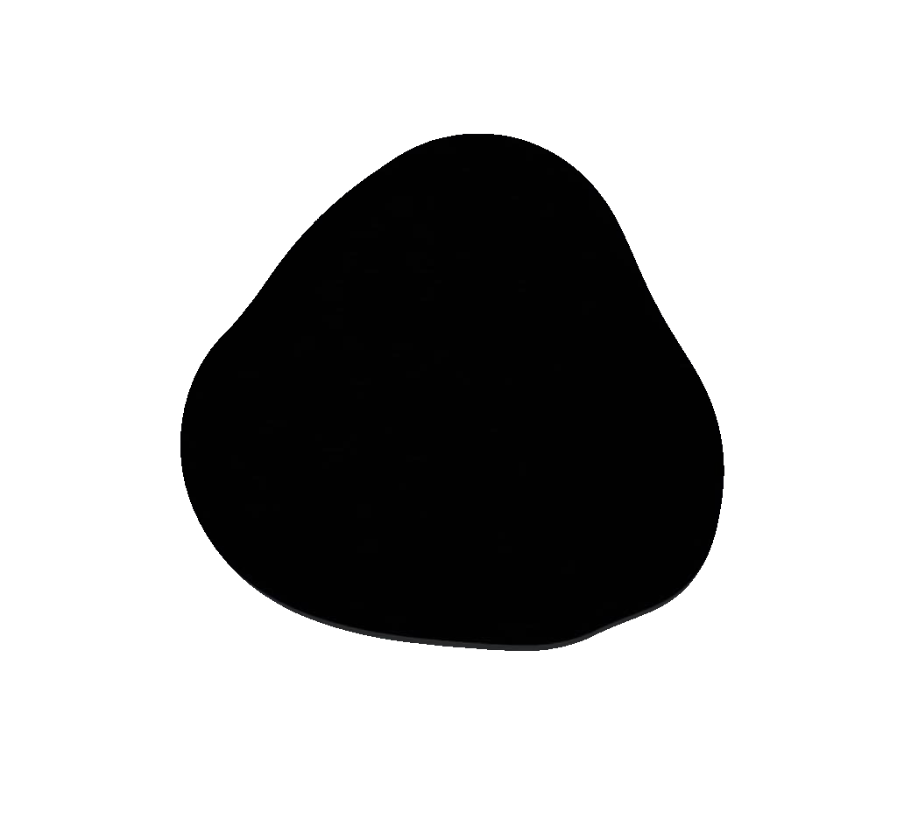
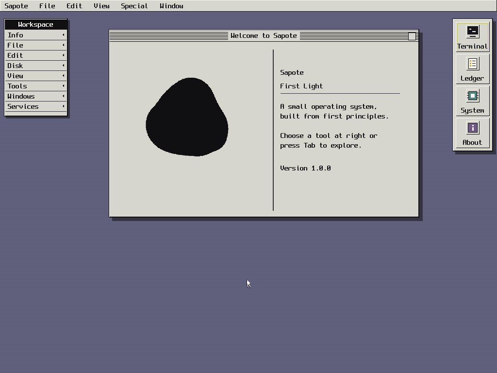

<p align="center">
  
</p>

<h1 align="center">Sapote</h1>

<p align="center">
  <strong>A small x86_64 operating system built from first principles.</strong><br>
  Sapote brings up its own hardware, proves each boot layer, and runs a measured slice of Linux userspace.
</p>

<p align="center">
  <a href="https://github.com/saudaljuaid/Sapote/actions/workflows/verify.yml"></a>
  
  <a href="LICENSE"></a>
</p>

<p align="center">
  
</p>

<p align="center"><sub>First Light, captured from a real 1024×768 QEMU boot.</sub></p>

<p align="center"><a href="assets/sapote-first-light-boot-20s.mp4">Watch the 20-second QEMU boot</a></p>

## Overview

Sapote is a freestanding operating system—not a Linux distribution and not a
hosted kernel demo. It enters 64-bit mode, discovers hardware, manages memory,
handles interrupts, drives a framebuffer, and presents its own graphical
workspace.

First Light is Sapote's compact desktop shell. It combines the canonical pebble
with a classic workstation interface, a terminal, keyboard and pointer input,
and four focused tools. In v1.0.0 its terminal can deliberately launch the two
measured BusyBox profiles with `linux echo` and `linux uname`, then return to
the same usable prompt.

## Current capabilities

- Four-level paging, W^X mappings, guarded stacks, a checked heap, and bounded DMA.
- ACPI/PCI discovery, APIC interrupts, MSI-X, monotonic time, and preemption.
- Bounded xHCI, NVMe, and read-only FAT16 controller/file proofs.
- Ring 3 execution with private address spaces and checked ELF64 loading.
- Linux `SYSCALL` support for measured BusyBox `echo` and `uname` programs.
- First Light, a framebuffer console, the `sap>` shell, and 41 QEMU scenarios.

## Build and boot

Ubuntu 24.04 or a compatible Debian environment is the reference host:

```sh
sudo apt-get install binutils gcc grub-common grub-pc-bin make mtools \
    qemu-system-x86 xorriso
rustup target add x86_64-unknown-none

make verify       # clean build and structural checks
make qemu-tests   # run all QEMU scenarios
make run          # boot First Light
```

Build products are written to `build/sapote.elf`, `build/sapote.iso`, and the
deterministic read-only userspace volume under `build/userspace/`.

## Engineering approach

C and x86_64 assembly own the machine-facing work. A small freestanding Rust
crate validates untrusted bytes—fonts, the logo, FAT16 metadata, and ELF64
programs—before C uses them. In short: **C operates the machine; Rust inspects
what enters it.**

The Boot Ledger records typed startup capabilities and verifies the installed
state. The build also rejects warnings, unresolved symbols, W+X mappings,
unexpected linker sections, floating-point/SIMD kernel instructions, and
unapproved boot-path shortcuts.

## Project status

Sapote is still a foundation-stage, single-core system. First Light is a fixed
kernel workspace rather than a general window manager. Storage and executable
support are read-only and deliberately bounded; networking, general process
services, an IOMMU, and broad physical-hardware coverage remain future work.
Version 1.0.0 stabilizes only this two-profile milestone contract. It is not a
claim of POSIX compliance, production readiness, general Linux binary
compatibility, or a broad stable userspace ABI.

## Documentation

- [Architecture](docs/ARCHITECTURE.md) — the durable map of the kernel
- [Boot Ledger](docs/BOOT_LEDGER.md) — startup dependencies and installed state
- [First Light](docs/FIRST_LIGHT.md) — interface and capture contract
- [Linux syscall boundary](docs/LINUX_SYSCALL_ABI.md) — measured BusyBox profiles
- [Rust boundary](docs/RUST.md) — where safe byte validation belongs
- [Verification](docs/VERIFICATION.md) — build, QEMU, and evidence gates

Small, reviewable contributions are welcome. See [CONTRIBUTING.md](CONTRIBUTING.md).
Sapote is licensed under [GPL-3.0-only](LICENSE).
