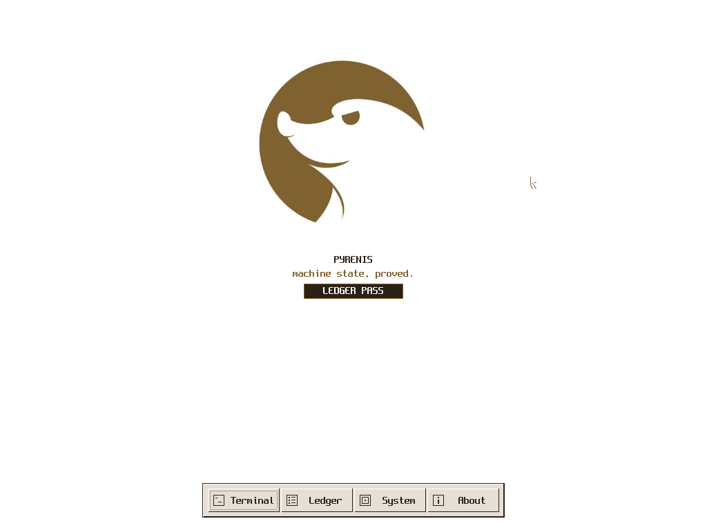

<p align="center">
  
</p>

<h1 align="center">Pyrenis</h1>

<p align="center">
  <strong>A capability-validated x86_64 kernel, built from the first instruction.</strong><br>
  Freestanding, hardware-close, and checked against the machine it actually boots.
</p>

<p align="center">
  <a href="https://github.com/saudaljuaid/Pyrenis/actions/workflows/verify.yml"></a>
  
  
  
  <a href="LICENSE"></a>
</p>

<p align="center">
  
</p>

<p align="center"><sub>A real 1024×768 Pyrenis First Light boot captured from QEMU.</sub></p>

## About

Pyrenis is an independent, freestanding operating-system kernel—not a Linux
distribution and not a userspace simulation. It boots through Multiboot2,
constructs its own x86_64 environment, discovers platform hardware, owns its
interrupt and timekeeping paths, and builds a protected memory foundation from
first principles.

The source explains the machine from entry to the shell. Boot-time checks,
deterministic QEMU scenarios, and deliberate negative controls make correctness
part of the architecture rather than a claim left to screenshots.

## Identity

The canonical mark is the exact 396×335 RGBA source at
[`assets/pyrenis-logo.png`](assets/pyrenis-logo.png). Pyrenis uses its bronze
`#806230` with white throughout the graphical console and repository artwork;
the source image is never redrawn, recoloured, cropped, or passed through a
runtime image parser. The complete asset and naming contract is in
[`docs/BRAND.md`](docs/BRAND.md).

## What is on the machine today

| Area | Current capability |
| --- | --- |
| Boot and CPU | Protected-mode entry, long mode, GDT, TSS, IDT, exception diagnostics, and a bounded typed Boot Ledger |
| Memory | Firmware memory map, bounded contiguous DMA, four-level paging, W^X, a validated device-window registry and MMIO arena, explicit PAT memory types, guarded heap and stacks |
| Interrupts and time | Local APIC, I/O APIC edge and level routes, dynamic vectors and MSI-X, retired PIC/PIT paths, PM timer, TSC, deadlines |
| Hardware discovery | Checksummed ACPI tables, checked PCI configuration reads/writes, bridge-aware enumeration, sized BAR claims, and explicit resource ownership |
| Scheduling | Guarded kernel threads, round-robin switching, and timer preemption |
| Graphics and input | Write-combining RGB framebuffer, cached drawing surface, screen console and shell, PS/2 keyboard/pointer, software cursor, and bounded First Light desktop shell |
| Language boundary | C11 and x86_64 assembly kernel; Rust only parses kernel-external logo and font bytes |
| Proof | Capability-validated boot receipts, installed-state invariants, deliberate fault probes, real VirtIO RNG DMA/MSI-X, actual framebuffer screenshots, and 33 deterministic QEMU scenarios |

## Build and run

Ubuntu 24.04 or a compatible Debian-based environment is the reference host:

```sh
sudo apt-get install binutils gcc grub-common grub-pc-bin make mtools \
    qemu-system-x86 xorriso
```

Install Rust through `rustup` first (see [`docs/RUST.md`](docs/RUST.md)), then
add its freestanding target and the repository hooks:

```sh
rustup target add x86_64-unknown-none
make hooks
```

Then choose the verification or boot target:

```sh
make verify       # clean build plus ELF, Multiboot2, symbol, and W^X checks
make qemu-tests   # all 33 deterministic fault, memory, device, and UI scenarios
make smoke        # strict normal-boot contract
make run          # interactive graphical boot
```

The build produces `build/pyrenis.elf` and `build/pyrenis.iso`.

## Documentation

- [`docs/DAY_ONE.md`](docs/DAY_ONE.md) — the boot contract and first verified milestone.
- [`docs/BRAND.md`](docs/BRAND.md) — canonical name, source logo, palette, and public naming rules.
- [`docs/BOOT_LEDGER.md`](docs/BOOT_LEDGER.md) — typed startup capabilities, canonical planning, receipts, and installed proof.
- [`docs/FIRST_LIGHT.md`](docs/FIRST_LIGHT.md) — desktop state, layout, dock, panels, damage, installed proof, screenshots, and controls.
- [`docs/UI_FONT.md`](docs/UI_FONT.md) and [`docs/POINTER.md`](docs/POINTER.md) — the licensed packed face and IRQ12 input/cursor path.
- [`docs/VIRTUAL_MEMORY.md`](docs/VIRTUAL_MEMORY.md) — page-table ownership and W^X proof.
- [`docs/DEVICE_WINDOWS.md`](docs/DEVICE_WINDOWS.md) — bounded physical windows and their WB/WC/UC policy.
- [`docs/IO_APIC.md`](docs/IO_APIC.md) — discovered interrupt routing and its controls.
- [`docs/MONOTONIC_TIME.md`](docs/MONOTONIC_TIME.md) — clocks, deadlines, and bounded waits.
- [`docs/PCI_ENUMERATION.md`](docs/PCI_ENUMERATION.md) — hardware discovery through two configuration paths.
- [`docs/PCI_RESOURCES.md`](docs/PCI_RESOURCES.md), [`docs/MSI_X.md`](docs/MSI_X.md), and [`docs/DMA.md`](docs/DMA.md) — claimed BARs, dynamic MSI-X delivery, and bounded DMA ownership.
- [`docs/DEVICE_FOUNDATION_VERIFICATION.md`](docs/DEVICE_FOUNDATION_VERIFICATION.md) — executed controls, proof evidence, accelerator sweeps, and the recorded flake.
- [`docs/THREADS.md`](docs/THREADS.md) — guarded threads, switching, and preemption.
- [`docs/FRAMEBUFFER.md`](docs/FRAMEBUFFER.md), [`docs/SURFACE.md`](docs/SURFACE.md), and [`docs/WRITE_COMBINING.md`](docs/WRITE_COMBINING.md) — pixels, cached drawing, memory types, and fenced presentation.
- [`docs/SCREEN_CONSOLE.md`](docs/SCREEN_CONSOLE.md) and [`docs/SHELL.md`](docs/SHELL.md) — the visible interactive path.
- [`docs/MAP.md`](docs/MAP.md) — the complete source and boot-order map.
- [`docs/WORKING_ON_PYRENIS.md`](docs/WORKING_ON_PYRENIS.md) — build, proof, and contribution workflow.
- [`CONTRIBUTING.md`](CONTRIBUTING.md) — project rules and submission expectations.

Every substantial subsystem has its own document under [`docs/`](docs/), with
its invariants, processor rules, failure modes, measurements, and negative
controls.

## Current limits

Pyrenis is still a foundation-stage kernel. First Light is a fixed kernel
desktop shell, not a window manager or userspace. The current `main` branch is
single-core and kernel-only; it has no userspace, filesystem, storage or network
driver, process isolation, IOMMU isolation, or general application ABI. Hardware evidence is
strongest in QEMU, with bare-metal coverage still an explicit goal.

## Contributing

Small, reviewable increments are welcome. Start with
[`CONTRIBUTING.md`](CONTRIBUTING.md), install the hooks, and keep every new loop
bounded and every new refusal named.

Pyrenis is licensed under [GPL-3.0-only](LICENSE).
